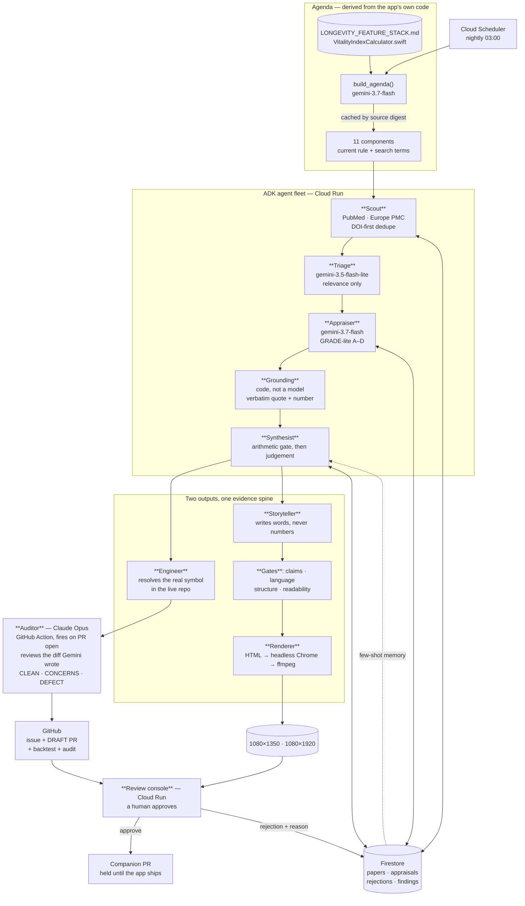

# Architecture

**Provenance** — an agent fleet that reads new health literature, proposes
algorithm changes as draft pull requests, and produces the content explaining
them. Every number it emits traces to a sentence quoted from a real abstract.

Subject application: **synqology**, a live iOS longevity app whose Vitality
Index scores users out of 100 across eleven weighted components.

---

## The loop



---

## The idea that makes it work

The fleet is never handed a list of research topics. It **reads the subject
application's own algorithm** — the prose specification and the Swift file the
constants actually live in — and derives what to search for from the code.

The Vitality Index credits a cardio day at 20 minutes and requires 3 such days
a week for full credit. From that, the agenda builder produces search terms
aimed at *those constants*:

```
mvpa (Cardio) · 16pt · 28-day window
  RULE: base score 0/75/150/300 min → 0/50/80/100, multiplied by
        day factor min(creditDays,3)/3, credit day ≥20 min
  SEARCH: "bout duration" · "weekend warrior" · "dose-response"
          · "accumulated physical activity"
```

The agenda is cached against a SHA of those source files, so **editing the
algorithm invalidates the research agenda automatically**. Nobody has to
remember to update a topic list, which means it cannot go stale.

---

## Stack

| Requirement | Choice | Where |
|---|---|---|
| Gemini 3.5+ | `gemini-3.7-flash` (reasoning) · `gemini-3.5-flash-lite` (triage) | `provenance/config.py` |
| Google Agent Framework | **ADK** — `LlmAgent`, `FunctionTool`, `before_tool_callback` | `provenance/agents/` |
| | **GenAI SDK** — structured extraction for the agenda | `provenance/agenda.py` |
| Google Cloud | **Firestore** — evidence store | `provenance/store/` |
| | **Cloud Run** — console + fleet | `Dockerfile` |
| | **Cloud Scheduler** — nightly trigger | 03:00 America/New_York |
| | **Secret Manager** — GitHub and email credentials | |
| Claude Opus | **GitHub Actions**, `anthropics/claude-code-action` — fires on `pull_request: opened` | `.github/workflows/opus-audit.yml`, in `synq` and `synq_insights` |
| | **Workload identity federation** — GitHub's own OIDC token exchanged for Claude API access; no static key in either repo | Claude Console → Workload identity |

Pub/Sub topics and a Cloud Storage bucket exist in the project and nothing
writes to them. The nightly run is a single Cloud Run Job that carries its own
state through Firestore, so an event bus between stages would be decoration
rather than architecture. They are named here only so nobody counts them as
part of the system.

Two version traps, recorded so they are not reintroduced:

- The most capable Gemini available is `gemini-3.1-pro-preview`, but the entry
  rule requires **3.5 or newer**. 3.1 < 3.5, so the Pro model is disqualifying.
- Gemini 3.5+ models are *listed* under regional endpoints but only answer on
  `global`. Pointing generation at `us-central1` returns 404 for a model that
  same region reports as available.

---

## Why it can be trusted

Every guarantee below is code with a test behind it, not a line in a prompt.

**1 · Claims must quote, and quotes are verified.**
The Appraiser returns a span for every claim. `grounding.py` checks it appears
in the retrieved text under a normalisation that forgives typography and
nothing else. A paraphrase fails.

**2 · Numbers must appear in the span they are attached to.**
A genuine quote with an invented effect size beside it passes a quote check and
fails here:

```
quote = "a hazard ratio of 0.82 (95% CI 0.74-0.91)"   ← verbatim, real
value = 0.62                                          ← invented
→ "value 0.62 does not appear in the quoted span"
```

**3 · One paper never moves the algorithm.**
A Finding opens only when ≥3 distinct papers challenge the same component, ≥1
is tier A/B, and they come from ≥2 DOI registrants. Pure arithmetic, run
*before* any model is consulted.

**4 · The merge tool does not exist.**
Not "the model is told not to merge" — there is no `github_merge` in the
toolset, and a `before_tool_callback` refuses any PR that is not `draft: true`
on a `provenance/*` branch.

**5 · Four gates stand between a model and a published claim.**

| Gate | Refuses |
|---|---|
| Claims | A figure no appraised claim reports |
| Language | Causal verbs on observational evidence; intensifiers |
| Structure | Charts with <2 points; decks where <3 slides carry one |
| Readability | Clinical vocabulary where a reader decides whether to continue |

The language gate is the one that catches what the others cannot. Its first
rejection was *"Concentrated training sharply reduces cardiovascular risk"* —
every figure grounded, and still wrong twice.

**6 · A reviewer's decision holds.**
Findings are keyed by a hash of their supporting papers, so one new study would
otherwise change the key and reopen a question already answered. After a
rejection, a component stays quiet until five more challenging papers exist.
Approval does not suppress — agreeing with a change is not a reason to stop
reading about the component.

**7 · Rejections are recorded with reasons.**
A pipeline that silently discards is indistinguishable from one that never
looked. 515 rejections are on file, each with a code: `not_relevant`,
`no_quantitative_result`, `ungrounded_claim`, `insufficient_convergence`,
`single_source`.

---

## The nightly run

`Cloud Scheduler (0 3 * * * America/New_York)` → OAuth as the fleet service
account → `Cloud Run Job provenance-nightly` → `python -m provenance.nightly`.

The scheduled path calls the same functions the CLI does, so there is no
production branch that can drift from the one under test.

Two things about it are deliberate:

**The cloud job does not read the algorithm.** It reads the agenda a local run
published to Firestore. The subject application lives in a private repository
and deriving the agenda from source is a developer-machine concern; the source
does not travel to a container. Since the agenda only changes when the
algorithm changes, and that happens where the code is, nothing goes stale.

**Opening pull requests is off on the schedule.** A draft PR is cheap to close
and still a notification to a person. One arriving nightly for the same finding
trains them to ignore it, which costs more than it saves. The nightly run does
research and findings; a human opens the proposal when a finding earns it.

Each run writes `provenance_runs/<timestamp>`, so "did it run last night, and
what did it decide" is answerable without reconstructing it from traces:

```
2026-08-18T12:48:58Z   new=123  seen=38   appraised=42  findings=1   130.8s
2026-08-18T12:50:27Z   new=0    seen=147  appraised=0   findings=1    24.9s
```

The second run is the interesting one. Same eleven queries ninety seconds
later, nothing new, no model calls spent. Novelty comes from identity, not from
a date filter: every paper carries a DOI-first id and the sweep drops what it
already holds. That is why the window is 18 months rather than 24 hours —
PubMed indexes papers days to weeks after publication, irregularly, and a
narrow window silently misses most of them.

## The second model

Gemini does everything on the code path: reads the algorithm, appraises the
literature, decides a constant is wrong, writes the Swift. One model, and a
human as the only check.

So a **Claude Opus audit** sits between the diff and the human. A GitHub
Action runs it the instant the pull request opens — no terminal session
required, authenticated through workload identity federation so there is no
static Anthropic key sitting in either repo. A local `/provenance` command
still exists, for opening the PR and sending the decision email, and a
`SessionStart` hook still nudges when a PR is waiting on that email — but the
audit itself no longer depends on either being run.

The ordering is the point:

```
nightly (cloud)     finds evidence, opens a Finding, stays silent
      ↓
/provenance         opens the draft PR
      ↓
GitHub Action        Opus audits the diff the instant it opens
                      audit posted as a PR comment
      ↓
/provenance notify   one email, carrying the verdict
      ↓
human approves        already knowing what the audit found
```

The obvious design — email as soon as the nightly run finds something — asks
for approval of code that has not been written, let alone reviewed. The cloud
job cannot run the auditing model, so the email waits.

**It earned its place on the first run.** Reviewing `synq#2` — a
Gemini-authored diff that had passed 51 tests and a human read — it found:

```swift
static func mvpaDayFactorDenominator(schedule: WorkSchedule?) -> Double {
    guard let schedule = schedule, schedule.isEnabled, schedule.isShiftWorker else { return 2.0 }
    return 2.0
}
```

Both branches return the same value. The guard was dead, and the shift-worker
accommodation it expressed was gone while the code still read as though it
implemented one. No test caught it: both assertions had been updated to `2.0`,
so deleting the whole guard left the suite green.

The obvious repair — restore the old 1.5 leniency ratio with a denominator of
1.33 — would have been silently worse. Both consumers evaluate
`min(creditDays, Int(d)) / d`: the numerator truncates and the divisor does
not, so every shift worker would have been capped at 0.75 of the score they
earned, permanently, with no test failing.

Fixed at 1.0, with three tests including a **relational** one asserting the
shift bar stays strictly easier than the default — pinning each value
separately is precisely what let the two converge. Reintroducing the original
bug now turns three tests red.

## Data flow for one night

```
507 papers retrieved        PubMed + Europe PMC, 11 component queries
      ↓  DOI-first dedupe
319 new
      ↓  triage  (flash-lite)
 49 relevant
      ↓  appraise (3.7-flash) + grounding
 70 appraised    ·  23 challenge a current constant
      ↓  convergence gate
  1 Finding      ·  10 components gated, with reasons
      ↓
GitHub issue #1 + draft PR #2      4 rendered slides + 1 reel
11 edits · 5 files · 51/51 tests   every figure from a verified claim
      ↓                                        ↓
              human approves in the console
```

---

## What it produced

A draft pull request against the live repository proposing the MVPA credit-day
target move from 3 to 2, on 22 appraised papers (20 tier-B), including
accelerometer cohorts from UK Biobank and NHANES and two meta-analyses.

The PR body carries the evidence table, the verified quote for each study, the
result of running the repository's own scoring suite against the change
(51/51 passing), the strongest argument *against* the change, and an
independence caveat the system computed itself:

> 9 of 22 cite UK Biobank, 4 of 22 cite NHANES. Papers re-analysing one cohort
> are repeated analyses rather than independent replications, and the
> convergence gate does not detect this. Weigh accordingly.

It also noticed, unprompted, that the proposed value would collapse a
distinction the code's own comment calls deliberate — shift workers already sit
at 2 — and said so in the pull request rather than hiding it.
