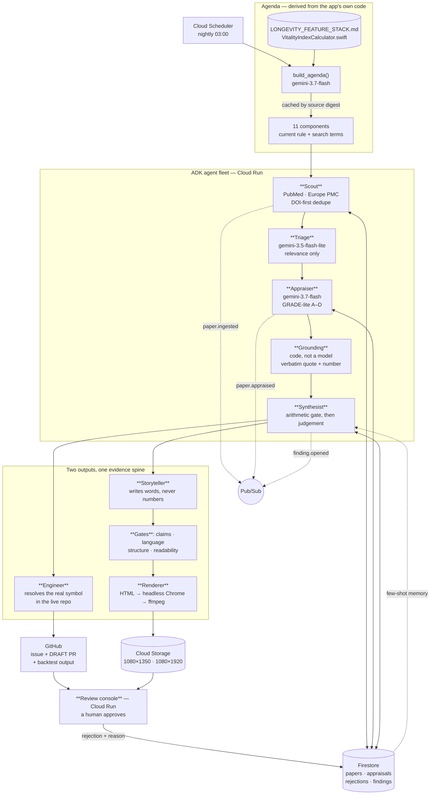

# Architecture

**Provenance** — an agent fleet that reads new health literature, proposes
algorithm changes as draft pull requests, and produces the content explaining
them. Every number it emits traces to a sentence quoted from a real abstract.

Subject application: **synqology**, a live iOS longevity app whose Vitality
Index scores users out of 100 across eleven weighted components.

---

## The loop



---

## The idea that makes it work

The fleet is never handed a list of research topics. It **reads the subject
application's own algorithm** — the prose specification and the Swift file the
constants actually live in — and derives what to search for from the code.

The Vitality Index credits a cardio day at 20 minutes and requires 3 such days
a week for full credit. From that, the agenda builder produces search terms
aimed at *those constants*:

```
mvpa (Cardio) · 16pt · 28-day window
  RULE: base score 0/75/150/300 min → 0/50/80/100, multiplied by
        day factor min(creditDays,3)/3, credit day ≥20 min
  SEARCH: "bout duration" · "weekend warrior" · "dose-response"
          · "accumulated physical activity"
```

The agenda is cached against a SHA of those source files, so **editing the
algorithm invalidates the research agenda automatically**. Nobody has to
remember to update a topic list, which means it cannot go stale.

---

## Stack

| Requirement | Choice | Where |
|---|---|---|
| Gemini 3.5+ | `gemini-3.7-flash` (reasoning) · `gemini-3.5-flash-lite` (triage) | `provenance/config.py` |
| Google Agent Framework | **ADK** — `LlmAgent`, `FunctionTool`, `before_tool_callback` | `provenance/agents/` |
| | **GenAI SDK** — structured extraction for the agenda | `provenance/agenda.py` |
| Google Cloud | **Firestore** — evidence store | `provenance/store/` |
| | **Cloud Run** — console + fleet | `Dockerfile` |
| | **Pub/Sub** — stage events | 4 topics |
| | **Cloud Scheduler** — nightly trigger | |
| | **Cloud Storage** — rendered creatives | |

Two version traps, recorded so they are not reintroduced:

- The most capable Gemini available is `gemini-3.1-pro-preview`, but the entry
  rule requires **3.5 or newer**. 3.1 < 3.5, so the Pro model is disqualifying.
- Gemini 3.5+ models are *listed* under regional endpoints but only answer on
  `global`. Pointing generation at `us-central1` returns 404 for a model that
  same region reports as available.

---

## Why it can be trusted

Every guarantee below is code with a test behind it, not a line in a prompt.

**1 · Claims must quote, and quotes are verified.**
The Appraiser returns a span for every claim. `grounding.py` checks it appears
in the retrieved text under a normalisation that forgives typography and
nothing else. A paraphrase fails.

**2 · Numbers must appear in the span they are attached to.**
A genuine quote with an invented effect size beside it passes a quote check and
fails here:

```
quote = "a hazard ratio of 0.82 (95% CI 0.74-0.91)"   ← verbatim, real
value = 0.62                                          ← invented
→ "value 0.62 does not appear in the quoted span"
```

**3 · One paper never moves the algorithm.**
A Finding opens only when ≥3 distinct papers challenge the same component, ≥1
is tier A/B, and they come from ≥2 DOI registrants. Pure arithmetic, run
*before* any model is consulted.

**4 · The merge tool does not exist.**
Not "the model is told not to merge" — there is no `github_merge` in the
toolset, and a `before_tool_callback` refuses any PR that is not `draft: true`
on a `provenance/*` branch.

**5 · Four gates stand between a model and a published claim.**

| Gate | Refuses |
|---|---|
| Claims | A figure no appraised claim reports |
| Language | Causal verbs on observational evidence; intensifiers |
| Structure | Charts with <2 points; decks where <3 slides carry one |
| Readability | Clinical vocabulary where a reader decides whether to continue |

The language gate is the one that catches what the others cannot. Its first
rejection was *"Concentrated training sharply reduces cardiovascular risk"* —
every figure grounded, and still wrong twice.

**6 · Rejections are recorded with reasons.**
A pipeline that silently discards is indistinguishable from one that never
looked. 515 rejections are on file, each with a code: `not_relevant`,
`no_quantitative_result`, `ungrounded_claim`, `insufficient_convergence`,
`single_source`.

---

## Data flow for one night

```
507 papers retrieved        PubMed + Europe PMC, 11 component queries
      ↓  DOI-first dedupe
319 new
      ↓  triage  (flash-lite)
 49 relevant
      ↓  appraise (3.7-flash) + grounding
 70 appraised    ·  23 challenge a current constant
      ↓  convergence gate
  1 Finding      ·  10 components gated, with reasons
      ↓
GitHub issue #1 + draft PR #2      4 rendered slides + 1 reel
11 edits · 5 files · 51/51 tests   every figure from a verified claim
      ↓                                        ↓
              human approves in the console
```

---

## What it produced

A draft pull request against the live repository proposing the MVPA credit-day
target move from 3 to 2, on 22 appraised papers (20 tier-B), including
accelerometer cohorts from UK Biobank and NHANES and two meta-analyses.

The PR body carries the evidence table, the verified quote for each study, the
result of running the repository's own scoring suite against the change
(51/51 passing), the strongest argument *against* the change, and an
independence caveat the system computed itself:

> 9 of 22 cite UK Biobank, 4 of 22 cite NHANES. Papers re-analysing one cohort
> are repeated analyses rather than independent replications, and the
> convergence gate does not detect this. Weigh accordingly.

It also noticed, unprompted, that the proposed value would collapse a
distinction the code's own comment calls deliberate — shift workers already sit
at 2 — and said so in the pull request rather than hiding it.
